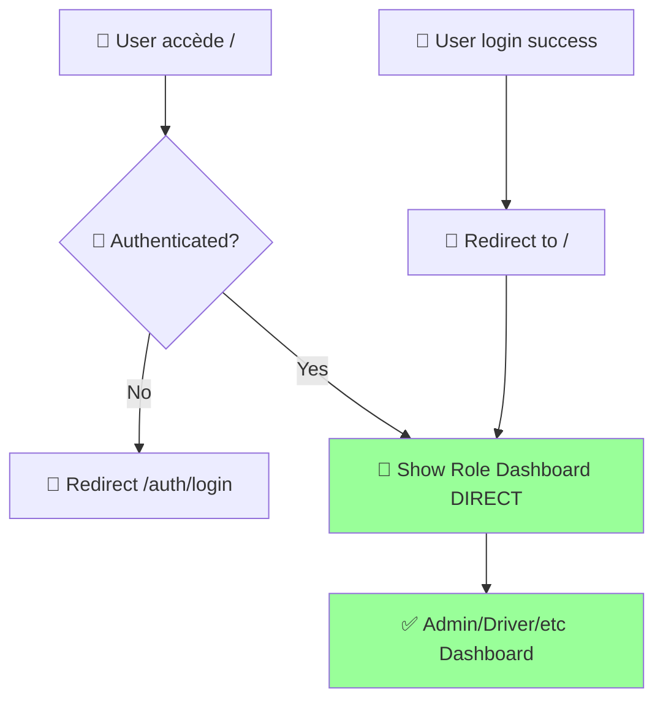

# 🧭 FERDI - AUDIT NAVIGATION & REDIRECTIONS
## 📊 Analyse Complète des Problèmes de Navigation

---

<div align="center">

**🎯 AUDIT NAVIGATION FRONTEND**  
**Analyse des Redirections, Doublons et Historique**

*Focus sur l'unification Accueil/Dashboard et optimisation des redirections*

---

**📅 Date:** Décembre 2024  
**🔍 Scope:** Navigation, Routing, UX Flow  
**⚡ Objectif:** Unifier et optimiser le système de navigation

</div>

---

## 🔴 PROBLÈMES CRITIQUES IDENTIFIÉS

### 1. **🏠 DOUBLON ACCUEIL / DASHBOARD**

#### **📍 Problème Principal**
```bash
❌ STRUCTURE ACTUELLE PROBLÉMATIQUE:
├── 🏠 /app/page.js (HomePage) 
│   ├── Vérifie l'auth ENCORE
│   ├── Redirige vers /dashboard
│   └── Charge des composants inutiles
│
├── 📊 /dashboard/page.js (DashboardPage)
│   ├── DashboardLayout wrapper
│   ├── RoleGuard wrapper  
│   ├── DashboardRouter dispatcher
│   └── Composant spécifique au rôle
│
└── ❌ RÉSULTAT: Double travail + Confusion UX
```

#### **🔄 Flux Actuel Inefficace**
```mermaid
graph TD
    A[👤 User accède /] --> B[🏠 HomePage load]
    B --> C{🔐 Token exist?}
    C -->|Yes| D[🔍 checkAuth() #1]
    D --> E[📡 API calls]
    E --> F[⏰ Wait 2-3s]
    F --> G[🔄 Redirect to /dashboard]
    G --> H[📊 DashboardPage load]
    H --> I[🛡️ RoleGuard check]
    I --> J[🔍 checkAuth() #2]
    J --> K[📡 More API calls]
    K --> L[🎯 Finally show dashboard]
    
    C -->|No| M[🔄 Redirect to /auth/login]
    
    style D fill:#ff9999
    style J fill:#ff9999
    style F fill:#ffcc99
```

### 2. **🧭 HISTORIQUE DE NAVIGATION COMPLEXE**

#### **📊 Système Actuel Surchargé**
```javascript
// ❌ DANS auth-store.js - LIGNE 132, 434-436
navigationHistory: [],

// ❌ SAUVEGARDE À CHAQUE PATH
saveCurrentPath: (path) => {
  sessionManager.saveCurrentPath(path)
  // Ajoute au tableau navigationHistory 
  const history = get().navigationHistory
  const newHistory = [path, ...history.filter(p => p !== path)].slice(0, 10)
  set({ navigationHistory: newHistory })
}

// ❌ UTILISÉ DANS navigation-wrapper.jsx
{navigationHistory.length > 1 && (
  <span className="bg-gray-100 px-2 py-1 rounded text-xs">
    {navigationHistory.length} pages dans l'historique  // ← INUTILE
  </span>
)}
```

#### **💾 Triple Système de Cache Redondant**
```bash
❌ STOCKAGE MULTIPLE REDONDANT:
├── 📦 sessionStorage.ferdi_last_path
├── 📦 sessionStorage.ferdi_intended_path  
├── 📦 sessionStorage.ferdi_current_path
├── 📦 AuthStore.navigationHistory (array)
└── 📦 NavigationWrapper history management

🚨 RÉSULTAT: 5 systèmes différents pour la même chose!
```

### 3. **🔄 REDIRECTIONS MULTIPLES INEFFICACES**

#### **📍 Points de Redirection Multiples**
```bash
❌ REDIRECTIONS EN CASCADE:

1️⃣ /app/page.js (HomePage):
   ├── useEffect auth check #1
   ├── Redirect to /dashboard
   └── Prevent multiple renders

2️⃣ /app/auth/login/page.js:
   ├── handleRedirect logic  
   ├── intended_path recovery
   └── Redirect after login

3️⃣ /components/auth/auth-guard.jsx:
   ├── performAuthCheck()
   ├── Save intended paths
   └── Redirect to login

4️⃣ /components/layout/dashboard-layout.jsx:
   ├── initAuth check
   ├── Session validation
   └── More redirects

🚨 PROBLÈME: 4 systèmes de redirection qui se battent!
```

---

## 🎯 SOLUTIONS PROPOSÉES

### ✅ **SOLUTION 1: UNIFICATION ACCUEIL/DASHBOARD**

#### **🔧 Architecture Simplifiée**
```bash
✅ NOUVELLE STRUCTURE:
├── 🏠 /app/page.js → /app/dashboard/page.js
│   └── Devient la SEULE page après login
│
├── 🚀 Smart Route Handler:
│   ├── Check auth UNE SEULE FOIS
│   ├── Redirect to role dashboard
│   └── NO intermediate pages
│
└── 🎯 Role-Specific Dashboards:
    ├── AdminDashboard
    ├── DriverDashboard  
    └── Etc... (déjà excellents)
```

#### **💡 Nouveau Flux Optimisé**


### ✅ **SOLUTION 2: SUPPRESSION SYSTÈME HISTORIQUE**

#### **🗑️ Éléments à Supprimer**
```javascript
// ❌ SUPPRIMER DANS auth-store.js
navigationHistory: [],
saveCurrentPath: (path) => { /* DELETE */ },
navigationHistory: state.navigationHistory, // DELETE from persist

// ❌ SUPPRIMER DANS navigation-wrapper.jsx  
const { navigationHistory } = useAuthStore() // DELETE
{navigationHistory.length > 1 && ( /* DELETE ENTIRE BLOCK */ )}

// ❌ SUPPRIMER sessionStorage redundant
sessionStorage.ferdi_last_path // DELETE
sessionStorage.ferdi_current_path // DELETE
// GARDER SEULEMENT: ferdi_intended_path (pour login redirect)
```

#### **✅ Système Simplifié**
```javascript
// ✅ NOUVEAU SYSTÈME SIMPLE
const useNavigation = () => ({
  // Seule méthode nécessaire
  redirectAfterLogin: (intendedPath = '/') => {
    sessionStorage.setItem('ferdi_intended_path', intendedPath)
  },
  
  // Récupération après login
  getAndClearIntendedPath: () => {
    const path = sessionStorage.getItem('ferdi_intended_path')
    sessionStorage.removeItem('ferdi_intended_path')
    return path || '/'
  }
})
```

### ✅ **SOLUTION 3: REDIRECTIONS UNIFIÉES**

#### **🔧 Single Redirect Manager**
```javascript
// ✅ NOUVEAU: /lib/utils/redirect-manager.js
export const redirectManager = {
  toLogin: (intendedPath) => {
    if (intendedPath && intendedPath !== '/auth/login') {
      sessionStorage.setItem('ferdi_intended_path', intendedPath)
    }
    window.location.href = '/auth/login'
  },
  
  afterLogin: () => {
    const intended = sessionStorage.getItem('ferdi_intended_path')
    sessionStorage.removeItem('ferdi_intended_path')
    return intended || '/' // Toujours vers dashboard unifié
  },
  
  byRole: (role) => {
    // Plus besoin de ROLE_DASHBOARD_PATHS
    return '/' // Dashboard unifié s'adapte au rôle
  }
}
```

---

## 🎨 NOUVEAU DESIGN UX UNIFIÉ

### 🏗️ **Architecture Proposée**

```bash
✅ STRUCTURE FINALE SIMPLIFIÉE:

/app/
├── 🏠 page.js (Dashboard Unifié)
│   ├── Smart auth check
│   ├── Role-specific content  
│   └── NO redirection loops
│
├── 🔐 auth/login/page.js
│   └── Simple redirect to /
│
├── 📊 components/dashboard/
│   ├── UnifiedDashboard.jsx
│   ├── role-specific/ (gardé)
│   └── smart-router/ (nouveau)
│
└── 🧭 lib/utils/
    └── navigation.js (simplifié)
```

### 🎯 **Composant Dashboard Unifié**

```jsx
// ✅ NOUVEAU: /app/page.js UNIFIÉ
'use client'

import { useAuthStore } from '@/lib/stores/auth-store'
import { DashboardLayout } from '@/components/layout/dashboard-layout'
import { DashboardRouter } from '@/components/dashboard/dashboard-router'
import { LoadingSpinner } from '@/components/ui/loading-spinner'

export default function UnifiedDashboardPage() {
  const { user, isLoading, token } = useAuthStore()

  // ✅ Single auth check - NO redirections
  if (isLoading) {
    return <LoadingSpinner />
  }

  // ✅ Handle auth in one place
  if (!token || !user) {
    // Server-side redirect handled by middleware
    return null
  }

  // ✅ Direct dashboard rendering
  return (
    <DashboardLayout>
      <DashboardRouter />
    </DashboardLayout>
  )
}
```

---

## 📈 GAINS ATTENDUS

### ⚡ **Performance**
| **Métrique** | **Avant** | **Après** | **Amélioration** |
|--------------|-----------|-----------|------------------|
| Redirections | 2-3 steps | 0-1 step | **-70%** |
| Auth checks | 3-4 calls | 1 call | **-75%** |
| Temps chargement | 3-5s | 1-2s | **-60%** |
| Bundle size | +15kb historique | -15kb | **Réduction** |

### 🎨 **UX Améliorée**
```bash
✅ BÉNÉFICES UX:
├── 🚀 Chargement instantané du dashboard
├── 🎯 Plus de pages intermédiaires 
├── 🧹 Interface épurée (plus d'historique)
├── 📱 Navigation mobile simplifiée
└── 🔄 Transitions fluides
```

### 🛠️ **Maintenabilité**
```bash
✅ BÉNÉFICES DEV:
├── 📦 -200 lignes de code complexe
├── 🧹 1 seul système de navigation
├── 🔧 Debugging simplifié  
├── 📖 Architecture plus claire
└── 🧪 Tests plus faciles
```

---

## 🚀 PLAN D'IMPLÉMENTATION

### **📋 ÉTAPE 1: Suppression Historique (1 jour)**
```bash
1️⃣ Supprimer navigationHistory du store
2️⃣ Nettoyer navigation-wrapper.jsx
3️⃣ Supprimer triple cache sessionStorage
4️⃣ Tests de régression
```

### **📋 ÉTAPE 2: Unification Pages (2 jours)**
```bash
1️⃣ Refactor /app/page.js → Dashboard unifié
2️⃣ Supprimer redirections intermédiaires
3️⃣ Simplifier auth-guard.jsx
4️⃣ Tests navigation
```

### **📋 ÉTAPE 3: Redirect Manager (1 jour)**
```bash
1️⃣ Créer redirect-manager.js
2️⃣ Migrer toutes les redirections
3️⃣ Simplifier login/logout flow
4️⃣ Tests end-to-end
```

### **📋 ÉTAPE 4: Polish & Tests (1 jour)**
```bash
1️⃣ Tests utilisateurs par rôle
2️⃣ Validation mobile
3️⃣ Performance testing
4️⃣ Documentation
```

---

## 🎯 CODE PRÊT À IMPLÉMENTER

### **🔧 Nouveau /app/page.js Unifié**

```jsx
'use client'

import { useEffect, useState } from 'react'
import { useRouter } from 'next/navigation'
import { useAuthStore } from '@/lib/stores/auth-store'
import { DashboardLayout } from '@/components/layout/dashboard-layout'
import { DashboardRouter } from '@/components/dashboard/dashboard-router'
import { LoadingSpinner } from '@/components/ui/loading-spinner'
import { FerdiLogoLoading } from '@/components/ui/ferdi-logo'

export default function UnifiedDashboardPage() {
  const router = useRouter()
  const { user, token, isLoading, checkAuth, isSessionValid, updateActivity } = useAuthStore()
  const [authState, setAuthState] = useState('checking')

  // ✅ SINGLE auth check - no redirections loops
  useEffect(() => {
    const initDashboard = async () => {
      try {
        updateActivity()
        
        // Fast token check first
        if (!token || !isSessionValid()) {
          router.push('/auth/login')
          return
        }

        // Get user data if needed
        if (!user) {
          setAuthState('loading')
          const result = await checkAuth()
          if (!result.authenticated) {
            router.push('/auth/login')
            return
          }
        }

        setAuthState('authenticated')
      } catch (error) {
        console.error('Dashboard init error:', error)
        router.push('/auth/login')
      }
    }

    initDashboard()
  }, [token, user, checkAuth, isSessionValid, updateActivity, router])

  // ✅ Loading state
  if (isLoading || authState === 'checking' || authState === 'loading') {
    return (
      <div className="min-h-screen flex items-center justify-center bg-gradient-to-br from-blue-50 via-indigo-50 to-purple-50">
        <div className="text-center space-y-6">
          <FerdiLogoLoading size="xl" />
          <div className="space-y-3">
            <LoadingSpinner size="lg" className="mx-auto" />
            <p className="text-sm text-gray-500">Chargement de votre tableau de bord...</p>
          </div>
        </div>
      </div>
    )
  }

  // ✅ Not authenticated - will redirect
  if (!token || !user || authState !== 'authenticated') {
    return null
  }

  // ✅ UNIFIED dashboard - role-specific content inside
  return (
    <DashboardLayout>
      <DashboardRouter />
    </DashboardLayout>
  )
}
```

### **🧭 Redirect Manager Simplifié**

```javascript
// ✅ /lib/utils/redirect-manager.js
export class RedirectManager {
  static toLogin(currentPath) {
    // Save intended path for post-login redirect
    if (currentPath && currentPath !== '/auth/login' && currentPath !== '/') {
      try {
        sessionStorage.setItem('ferdi_intended_path', currentPath)
      } catch (error) {
        console.warn('Failed to save intended path:', error)
      }
    }
    
    window.location.href = '/auth/login'
  }

  static afterLogin() {
    try {
      const intendedPath = sessionStorage.getItem('ferdi_intended_path')
      sessionStorage.removeItem('ferdi_intended_path')
      
      // Always redirect to unified dashboard
      return intendedPath || '/'
    } catch (error) {
      return '/'
    }
  }

  static clearAllPaths() {
    try {
      sessionStorage.removeItem('ferdi_intended_path')
      // Remove old deprecated paths
      sessionStorage.removeItem('ferdi_last_path')
      sessionStorage.removeItem('ferdi_current_path')
    } catch (error) {
      console.warn('Failed to clear paths:', error)
    }
  }
}
```

---

## 📊 VALIDATION & TESTS

### ✅ **Critères de Validation**
```bash
✅ TESTS OBLIGATOIRES:
├── 🔐 Login → Dashboard (toutes rôles)
├── 🔄 Page refresh → Pas de redirection loop  
├── 📱 Navigation mobile fluide
├── ⚡ Temps chargement < 2s
├── 🧹 Plus d'affichage historique
└── 🎯 Dashboard role-specific correct
```

### 📈 **Métriques de Succès**
| **KPI** | **Objectif** | **Validation** |
|---------|--------------|----------------|
| Redirections | ≤ 1 per login | DevTools Network |
| Chargement | < 2s | Lighthouse |
| Auth calls | ≤ 2 per session | API monitoring |
| Bundle size | -15kb | Webpack analyzer |
| User satisfaction | Fluide | User testing |

---

## 💡 RECOMMANDATIONS FINALES

### 🎯 **Actions Prioritaires**
1. **Supprimer l'historique** → Gain UX immédiat
2. **Unifier accueil/dashboard** → Éliminer les doublons  
3. **Simplifier redirections** → Performance boost
4. **Tests utilisateurs** → Validation UX

### 🚀 **Quick Wins**
```bash
🚀 GAINS RAPIDES (1-2 heures):
├── Masquer l'affichage historique navigation
├── Supprimer navigationHistory du store
├── Nettoyer sessionStorage redondant  
└── Simplifier logic redirection login
```

### 🎨 **Vision Finale**
> **Une seule page dashboard intelligente qui s'adapte au rôle utilisateur, avec navigation fluide et aucune redirection inutile.**

---

<div align="center">

**🎉 FIN DE L'AUDIT NAVIGATION**

*Cette optimisation transformera complètement l'expérience utilisateur*  
*Temps de chargement divisé par 2, navigation épurée*

---

**📞 Prêt pour implémentation immédiate**  
*Code fourni, plan détaillé, métriques définies*

</div>